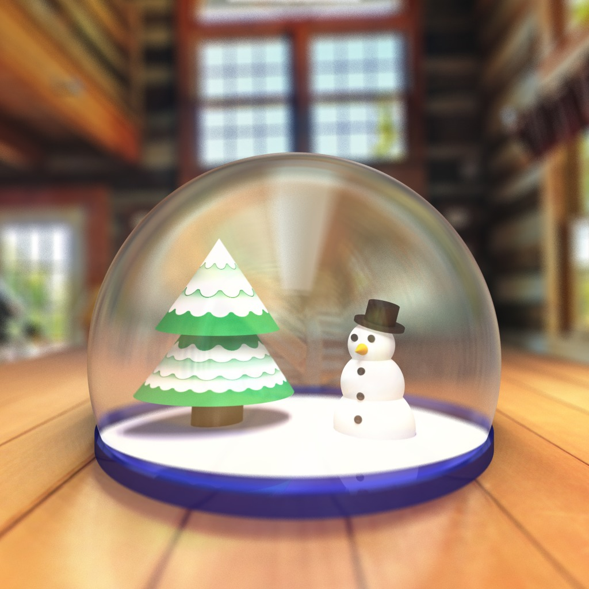
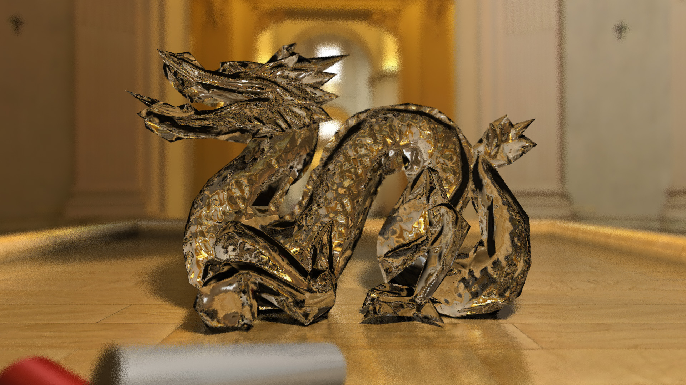
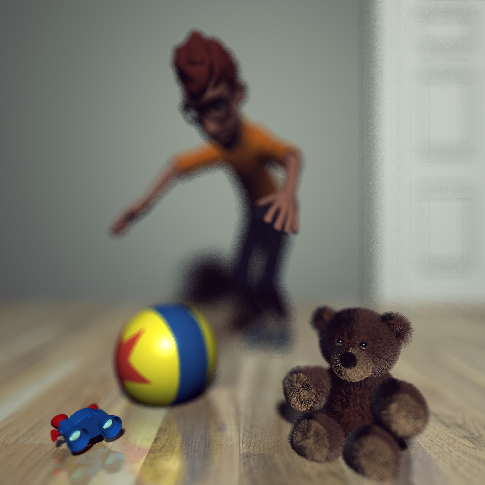
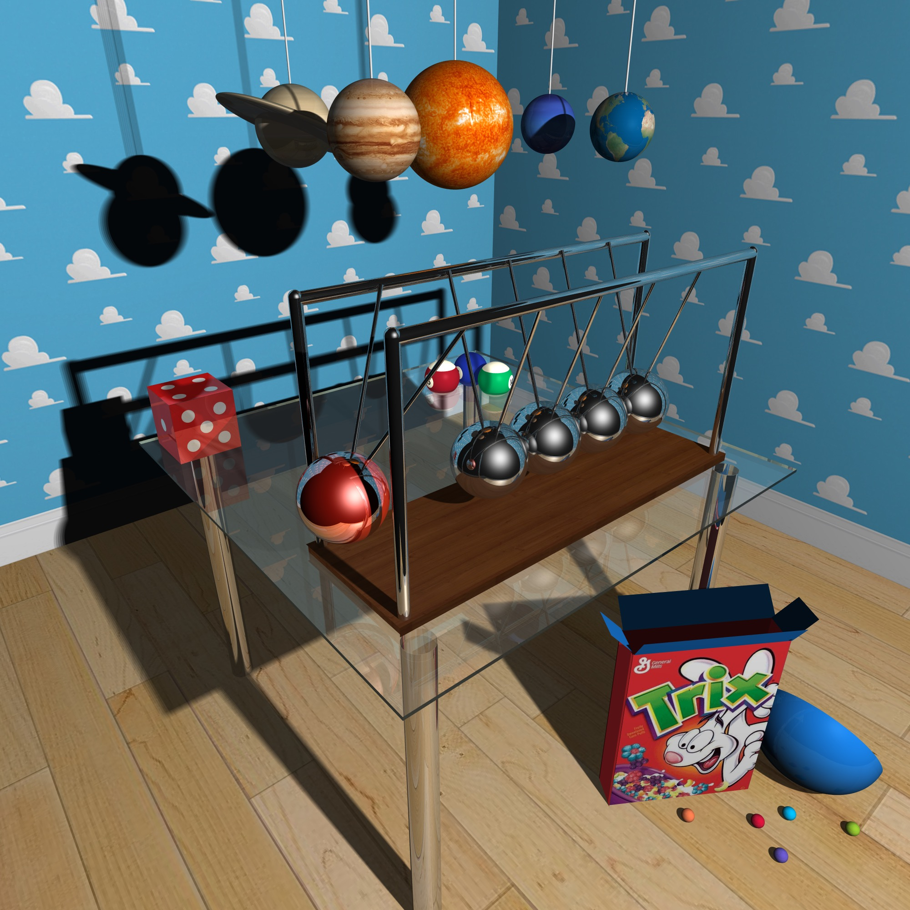
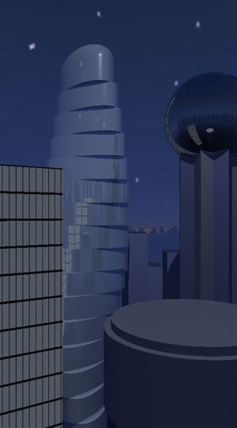
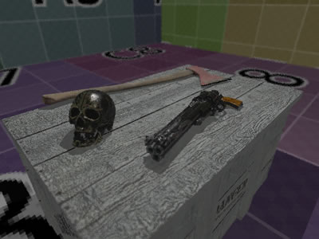

# Computer Graphics – Final Image Competition

This assignment is open-ended and creative. The task is simply to make a
computer graphics image, video, animation, or interactive experience.

## Ground rules

You may use external code, models or other assets so long as you acknowledge
your sources. Keep in mind your entry will be judged according to the _delta_ of
the part you implemented over any existing code/assets.

You are encouraged (but not required) to start with one of the existing
assignments and expand its functionality.

Ultimately, your code needs to produce a visual artifact: image, video animation
or screen recording of an interaction.

## Past winners

Gavin Barill and Trevor Anderson's "Snowglobe", Winter 2016.

Muhammed Anwar's "Stanford Dragon", Fall 2016

Ryan Williams' "Toys", Winter 2016

David La's "Newton's Cradle", Winter 2016

Monica Iulia Leonte's "City", Winter 2017

Jiahui Cai's "Table", Winter 2017

Darren Moore's "Bounce", Winter 2017

## Tasks

Your submission has three parts:

### `submission/README.md`

A short readme describing the work _you've_ done and an acknowledgment of any
existing code/assets you've _not_ done yourself. ***In the readme, please include your lecture section at the top***.

### `submission/source.zip`

A [.zip archive](https://en.wikipedia.org/wiki/Zip_(file_format)) of all
source/assets needed to _reproduce_ your work

### `submission/image.png` _or_ `submission/video.mp4`

An image (as a .png) or video (as a .mp4) demonstrating your result. For
interactive experiences or games record a prototypical use as a screen
recording. Use as high resolution as possible. For example, a [Full
HD](https://en.wikipedia.org/wiki/1080p) image is 1920×1080 pixels.
